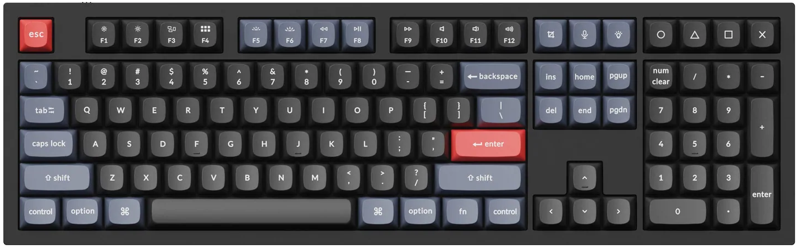

# `not_keychron_q6`

This is ***not*** the code to the Keychron Q6 *(but it is the one I use)*.

---

> :warning: : THIS CODE IS INTENDED FOR EDUCATIONAL PURPOSES ONLY AND DOES NOT REPRESENT KEYCHRON IN ANY WAY.

---

***

## Why?

Basically, I wanted to compile from `qmk/qmk_firmware:master` but that code caused me strife.  So I wrote my own, different in the following ways:

* Initially I ported the code to make use of the I²C EEPROM slot on the Q1 PCB. *(This code is still there, but now requires the `EEPROM=1` make command argument added.)*
* The code consolidates all the different variants in `keychron/qmk_firmware:playground` into one common source code base. *(I'm a huge proponent of refactoring.)*
* With a recent PR into `qmk/qmk_firmware:develop` QMK admins added a EFL/EL driver that now allows the STM32 flash to run as an emulated EEPROM.  This code is now incorporated and is the default compile.

Use this code to learn from - but it's not endorsed by either Keychron or QMK.

## How To

Please read the [HOW2COMPILE.md](HOW2COMPILE.md) file for instructions on how to use this code.

-- Made with :heart: &nbsp; by Vino Rodrigues
